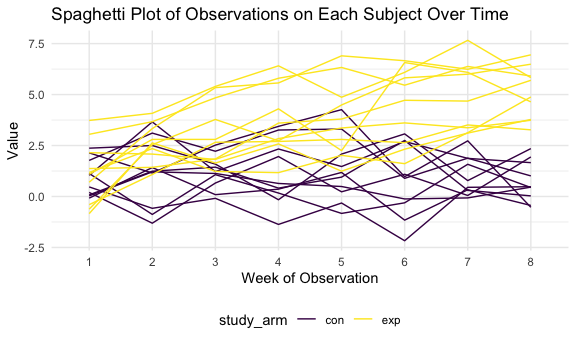
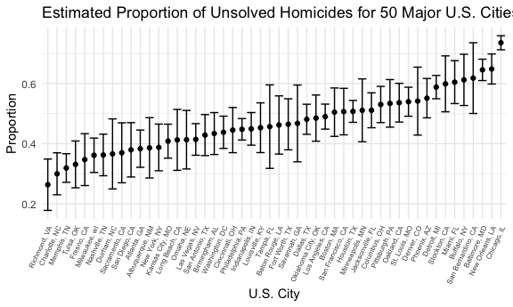
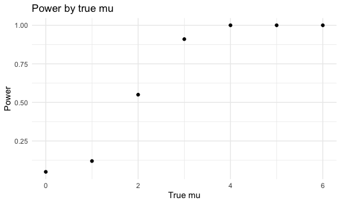
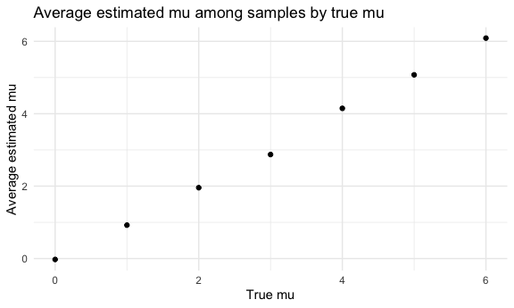
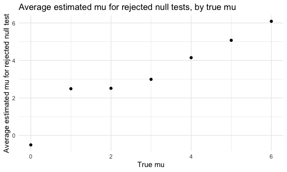

p8105_hw5_af3341
================
Alana Ferris
2022-11-09

# Problem 1

## Creating a Dataframe

``` r
long_study_df = list.files(path = "./data")

study_df = tibble(files = long_study_df)

read_files = 
  function(filename) {
  participant_data = 
  read_csv(file = paste0("./data/", filename)) %>%
  mutate(study_arm = filename)
}

study_data =
  map_df(study_df, read_files)
```

    ## Rows: 20 Columns: 8
    ## ── Column specification ────────────────────────────────────────────────────────
    ## Delimiter: ","
    ## dbl (8): week_1, week_2, week_3, week_4, week_5, week_6, week_7, week_8
    ## 
    ## ℹ Use `spec()` to retrieve the full column specification for this data.
    ## ℹ Specify the column types or set `show_col_types = FALSE` to quiet this message.

## Tidying the Dataframe

``` r
tidy_df = 
  study_data %>% 
  pivot_longer(
    week_1:week_8,
    names_to = "week",
    values_to = "value",
    names_prefix = "week_"
  ) %>% 
  separate(study_arm, into = c("study_arm", "subject_id"), sep = "_", convert = TRUE) %>% 
  mutate(
    subject_id = str_replace(subject_id, ".csv", "")) %>%
  group_by(study_arm, subject_id) %>% 
  mutate(
    unique_id = paste0(study_arm, subject_id)
  ) %>% 
  select(study_arm, subject_id, unique_id, week, value)
```

## Spaghetti Plot

``` r
tidy_df %>% 
  ggplot(aes(x = week, y = value, group = unique_id, color = study_arm)) + 
  geom_line() +
  labs(
    x = "Week of Observation",
    y = "Value",
    title = "Spaghetti Plot of Observations on Each Subject Over Time")
```



As shown in the plot above, the experimental arm of the 8-week
longitudinal study has higher recorded values than the control arm of
the study.

# Problem 2

## Reading in and describing data

``` r
homicides = 
  read_csv("./problem_2_data/homicide-data.csv")
```

The `homicides` dataset contains 52179 observations of individual
homicides committed in \~50 large US cities from 2007-2017. Cities were
selected based on their size and violent crime reported to the FBI in
2012. There are 12 total variables in this dataset, which include the
date of the murder, victim demographics, location of the murder, and
current case status.

## Data manipulations

``` r
total_homicide = homicides %>% 
 mutate(city = str_replace(city, "$", ", ")) %>% 
  mutate(city_state = 
    paste0(city, state)) %>% 
  group_by(city_state) %>% 
  mutate(unsolved = 
           case_when(disposition == 'Closed without arrest' | 
                    disposition == 'Open/No arrest' ~ TRUE, 
                    disposition == 'Closed by arrest'~ FALSE)) %>% 
  summarize(
    total_homicide = n()) 
  
unsolved_homicide = homicides %>% 
 mutate(city = str_replace(city, "$", ", ")) %>% 
  mutate(city_state = 
    paste0(city, state)) %>% 
  group_by(city_state) %>% 
    filter(disposition == 'Closed without arrest' | disposition == 'Open/No arrest') %>% 
     summarize(
    unsolved = n())
```

## `prop.test` for Baltimore

``` r
summary = left_join(total_homicide, unsolved_homicide, by = "city_state") %>% 
 drop_na()
 
balt_test = summary %>% 
  filter(city_state == "Baltimore, MD") 
  
bmore_output = 
  prop.test(balt_test %>% pull(unsolved), balt_test %>% pull(total_homicide)) %>% 
  broom::tidy() %>% 
  select(estimate, starts_with("conf"))
```

## `prop.test` function

``` r
prop_test = 
  function(summary) {
    output =  
      prop.test(summary %>% pull(unsolved), summary %>% pull(total_homicide)) %>% 
      broom::tidy() %>% 
      select(estimate, starts_with("conf"))
  }
```

## Mapping function across all cities

``` r
summary_nested = 
  summary %>% 
  nest(data = unsolved:total_homicide)

summary_unnested = 
  summary_nested %>% 
  mutate(
    prop_cities = map(data, prop_test)) %>% 
  unnest(prop_cities)
```

## Plot of proportion estimates and confidence intervals for all cities

``` r
summary_unnested %>% 
  mutate(
    ci = conf.high - conf.low,  
    city_state = fct_reorder(city_state, estimate)
  ) %>% 
  ggplot(aes(x = city_state, y = estimate)) + 
  geom_point() + 
  geom_errorbar(aes(x = city_state, ymin = estimate - ci, ymax = estimate + ci)) + 
  theme(axis.text.x = element_text(angle = 65, hjust = 1, size = 6)) +
   labs(
    title = "Estimated Proportion of Unsolved Homicides for 50 Major U.S. Cities",
    x = "U.S. City",
    y = "Proportion")
```



# Problem 3

## Generating 5000 Datasets with mu = 0

``` r
sim_t_test =
  function(n = 30, mu = 0, sigma = 5) {
 
    sim_data = tibble(
  x = rnorm(n = n, mean = mu, sd = sigma)
    )

    t.test(sim_data, mu = 0, conf.level = 0.95) %>% 
      broom::tidy() %>% 
      select(estimate, p.value)
  
  }

sim_results_df = 
  expand_grid(
  sample_size = 30,
  true_sigma = 5,
  true_mu = 0,
  iteration = 1:100
) %>% 
  mutate(
    estimate_df = map(sample_size, sim_t_test)
  ) %>% 
  unnest(estimate_df)
```

## Changing the mu = {1,2,3,4,5,6}

``` r
sim_mu_results = 
  tibble(
    mu = (0:6),
    simulations = map(.x = mu, ~rerun(100, sim_t_test(mu = .x)))
  ) %>% 
  unnest(c(simulations)) %>% 
  unnest(c(simulations))
```

## Power Plot

``` r
sim_mu_results %>% 
  mutate(null_rejected = p.value < .05) %>% 
  group_by(mu) %>% 
  summarize(prop_rejected = mean(null_rejected)) %>% 
  ggplot(aes(x = mu, y = prop_rejected)) +
  geom_point() +
  labs(
    title = "Power by true mu",
    x = "True mu",
    y = "Power"
  )
```



Here we can see that power increases as the effect size increases; it
approaches 1 as the true mu increases. The power is the probability of
rejecting the null hypothesis given the null hypothesis is false. It
depends on the sample size, the effect size, and the significance level
of the test. The effect size is calculated by taking the difference of
mu hat from the true mu and dividing by the standard deviation. So, it
makes sense why we are seeing a positive correlation between power and
effect size because as the true mu increases and the standard deviation
stays the same, the effect size will be larger and thus so will power.

## Plot of average estimate of μ̂ versus true value of mu

``` r
sim_mu_results %>% 
  group_by(mu) %>% 
  summarize(average_estimate = mean(estimate)) %>% 
  ggplot(aes(x = mu, y = average_estimate)) +
  geom_point() +
  labs(
    title = "Average estimated mu among samples by true mu",
    x = "True mu",
    y = "Average estimated mu"
  )
```



## Plot of average estimate of μ̂ only in samples for which the null was rejected versus the true value of μ

``` r
sim_mu_results %>% 
  mutate(null_rejected = p.value < .05) %>% 
  filter(null_rejected == TRUE) %>% 
  group_by(mu) %>% 
  summarize(average_estimate = mean(estimate)) %>% 
  ggplot(aes(x = mu, y = average_estimate)) +
  geom_point() +
  labs(
    title = "Average estimated mu for rejected null tests, by true mu",
    x = "True mu",
    y = "Average estimated mu for rejected null test"
  )
```



We can see that for true mu 4, 5, and 6, the mu hat was a good estimate.
However, for true mu of 0, the mu hat underestimated the true mu. For
true mu of 1, 2, and 3, the mu hat overestimated the true mu. This
indicates that the sample average of mu hat for tests where the null is
rejected is generally not a good approximation of the true mu. This poor
estimation of the true mu makes sense since we are only looking at tests
where the p value is significant (a `t.test` where we conclude to reject
the null). Scenarios where we reject the null would be when the
estimated mu is significantly different from the true mu (the null).
